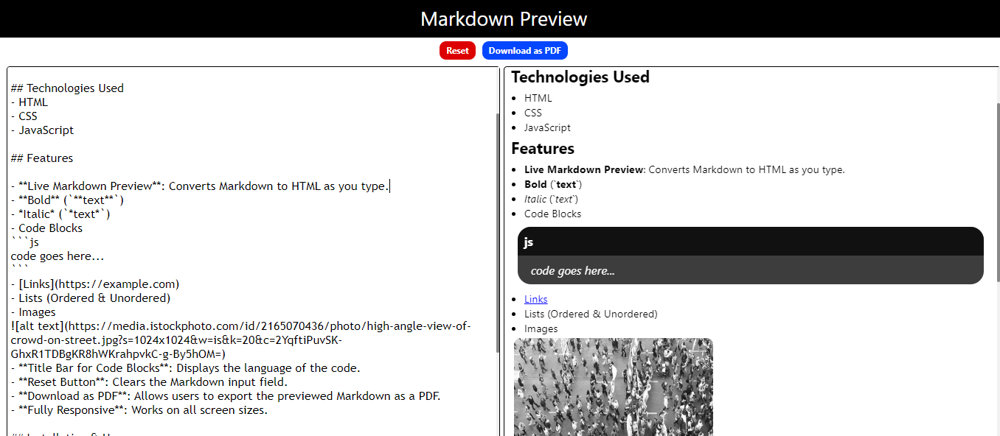

# Markdown Previewer

A simple web-based Markdown Previewer that converts Markdown syntax into formatted HTML in real-time.

## Features

- **Live Markdown Preview**: Converts Markdown to HTML as you type.
- **Supports Basic Markdown Syntax**:
  - **Bold** (`**text**`)
  - *Italic* (`*text*`)
  - ~~Strikethrough~~ (`~~Strikethrough~~`)
  - <ins>Underline</ins>(`__Underline__`)
  - Code Blocks (`
  ```lang (code)```
  `)
  - [Links](https://example.com) (`[text](URL)`)
  - Lists (Ordered & Unordered)
  - Images (``)  
- **Title Bar for Code Blocks**: Displays the language of the code.
- **Reset Button**: Clears the Markdown input field.
- **Download as PDF**: Allows users to export the previewed Markdown as a PDF.
- **Fully Responsive**: Works on all screen sizes.

## Installation & Usage

1. Clone this repository:
   ```bash
   git clone https://github.com/033himanshu/markdown-preview.git
   ```
2. Open `index.html` in a browser.
3. Start typing Markdown in the input field and see the live preview!

## Screenshots



## Technologies Used
- HTML
- CSS
- JavaScript

